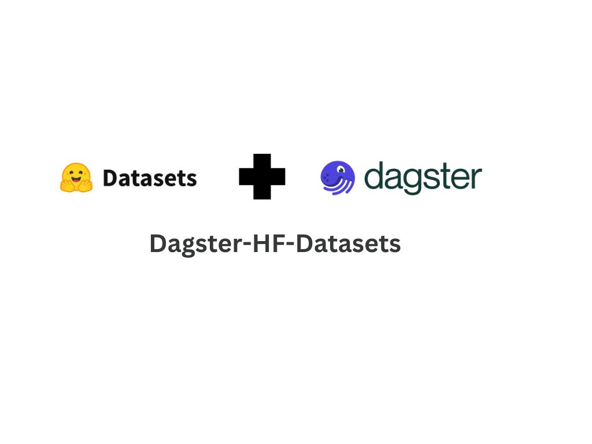

# Dagster-HF-Datasets

<p align="center">
  
</p>

## Overview

Dagster-HF-Datasets helps you use Hugging Face datasets as Dagster assets.

It provides:

- dataset assets for Hugging Face datasets
- streaming dataset support
- parquet-backed persistence
- metadata enrichment
- multi-asset dataset pipelines
- Hugging Face Hub publishing utilities

The library is designed for building reproducible dataset pipelines with Dagster and Hugging Face.

---

## Installation

```bash
pip install dagster-hf-datasets
```

## Development Install:

```bash
git clone https://github.com/dagster-io/dagster.git

cd libraries/dagster-hf-datasets

pip install -e .
```

---

## Quickstart

You can refer

---

## Main APIs


### `HuggingFaceResource`

Resource for loading datasets from the Hugging Face Hub.

### `hf_dataset_asset`

Create a Dagster asset from a Hugging Face dataset.

### `hf_multi_asset`

Create split-aware multi-assets for HF datasets with multiple splits.

---

## Features

- Hugging Face dataset assets
- streaming dataset ingestion
- metadata extraction
- parquet persistence
- runtime-only streaming support
- dataset publishing utilities
- lineage-aware dataset pipelines

---

## Examples

### Golden Dataset Pipeline

Dataset cleaning and preprocessing pipeline with:

- filtering
- normalization
- deduplication
- Hugging Face Hub publishing

Example file:

```text
examples/golden_dataset_pipeline.py
```

---

### Runtime Streaming Pipeline

Streaming dataset pipeline demonstrating:

- runtime-only ingestion
- streaming preprocessing
- Dataset materialization
- downstream parquet persistence

Example file:

```text
examples/runtime_streaming_pipeline.py
```

---

### Multi-Asset Dataset Pipeline

Multi-split dataset orchestration example with:

- split-aware assets
- metadata enrichment
- Hugging Face Hub metadata
- Dagster lineage tracking


Example file:

```text
examples/multi_asset_pipeline.py
```

---

## Documentation

### API Documentation

Placeholder link:

```text
docs/api/
```

### Usage

Placeholder link:

```text
docs/guides/
```

---

## Development

### Test

```bash
make test
```

### Build

```bash
make build
```
---
